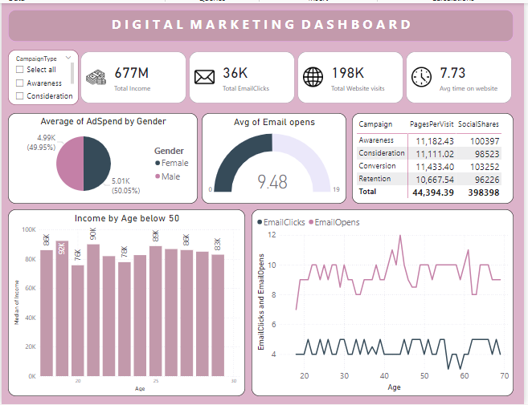

# Customer Conversion Insights in Digital Marketing- Power BI Project

## Project Overview
This Power BI project analyzes **customer engagement** and **conversion metrics** across multiple marketing campaigns. The goal is to derive actionable insights that help optimize marketing strategies, improve customer conversions, and enhance campaign efficiency.

---

## Data Description
The dataset includes customer-related information, marketing campaign details, and conversion metrics. Below is a breakdown of the dataset:

| **Column Name**           | **Description**                                                                 |
|---------------------------|-------------------------------------------------------------------------------|
| **CustomerID**            | Unique ID for each customer.                                                  |
| **Age**                   | Age of the customer.                                                          |
| **Gender**                | Gender of the customer (e.g., Male/Female).                                   |
| **Income**                | Annual income of the customer.                                                |
| **CampaignChannel**       | Marketing channel (e.g., Social Media, Email, PPC).                           |
| **CampaignType**          | Type of campaign (e.g., Awareness, Retention).                                |
| **AdSpend**               | Total ad spend in the campaign (monetary value).                              |
| **ClickThroughRate**      | Percentage of users clicking on the campaign ad.                              |
| **ConversionRate**        | Percentage of users converting after interacting with the ad.                 |
| **WebsiteVisits**         | Number of visits to the website during the campaign.                          |
| **PagesPerVisit**         | Average number of pages visited during a session.                             |
| **TimeOnSite**            | Average time spent on the website (in minutes).                               |
| **SocialShares**          | Number of times the campaign was shared on social media.                      |
| **EmailOpens**            | Number of campaign-related emails opened by the customer.                     |
| **EmailClicks**           | Number of clicks on links within the campaign emails.                         |
| **PreviousPurchases**     | Number of purchases made by the customer before this campaign.                |
| **LoyaltyPoints**         | Loyalty points accumulated by the customer.                                   |
| **AdvertisingPlatform**   | Advertising platform used (e.g., IsConfid).                                   |
| **AdvertisingTool**       | Tool used for advertising campaigns (e.g., ToolConfid).                       |
| **Conversion**            | Binary outcome (1 for conversion, 0 for no conversion).                       |

---

## Project Goals

1. **Understand Customer Behavior**: Analyze customer data to identify behavior patterns.
2. **Evaluate Campaign Performance**: Measure campaign effectiveness across channels.
3. **Identify Key Drivers of Conversion**: Discover which metrics (AdSpend, ClickThroughRate, etc.) contribute most to conversions.
4. **Optimize Marketing Strategy**: Provide actionable insights to improve future campaigns.

---

## Insights and Visualizations

In this Power BI report:
- **Demographics Analysis**: Age, gender, and income distribution.
- **Campaign Performance**: Conversion rates, ClickThroughRates, and AdSpend comparisons across channels and campaign types.
- **Engagement Metrics**: Website visits, social shares, email interactions, and time on site.

---

## Dashboard 

